# How can I read and write to Azure SQL DB or Azure Postgres from an Azure Databricks notebook?
The mechanics of reading and writing to a database from a Databricks notebook are largely the same regardless of which database you're targeting.  The main differences have to do with how you set up the database user, manage permissions and create the connection.

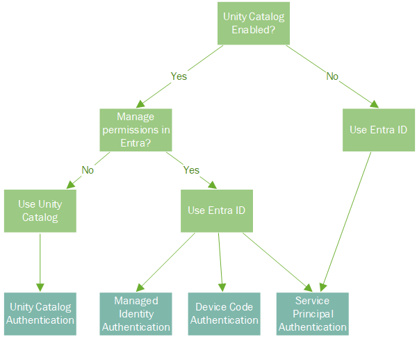

If your Databricks workspace is Unity Catalog-enabled but you want to manage permissions in Entra ID on the data source itself, you can use managed identity, device code credentials or service principal. Depending on which option you choose, the code you use to get the token will look a little different.  The solution below will guide you through each of the options.

See the Unity Catalog solution if you'd prefer to manage permissions in Unity Catalog instead.  This is a good option if most of your solution is running in Databricks and you don't need to replicate permissions in Entra.

If you're still using the legacy hive metastore with Databricks, your only option is service principal authentication.  Please refer to the demo on [setting up service principal authentication](https://github.com/benijake/databricks-read-write-database-sp).


# Solution
- [Prerequisites](#prerequisites)
- [Azure SQL DB](#azure-sql-db)
- [Azure Postgres](#azure-postgres)
  
## Prerequisites
### Create the Databricks workspace
First, create a Databricks workspace. Many of the new Databricks features like serverless, data lineage and managed identity support require Unity Catalog. Unity Catalog is normally enabled now by default when you create new workspace and gives you the most authentication options when connecting to Azure resources like databases. For this demo, we will assume that your Databricks workspace is enabled for Unity Catalog.

#### Create a compute cluster
Choose a provisioned cluster to use managed identity authentication.  Currently, serverless clusters don't support managed identity authentication. 
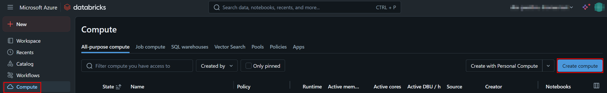

After the cluster has been created, click on the cluster name in the list and then switch to the libraries tab to install azure-identity with PyPi

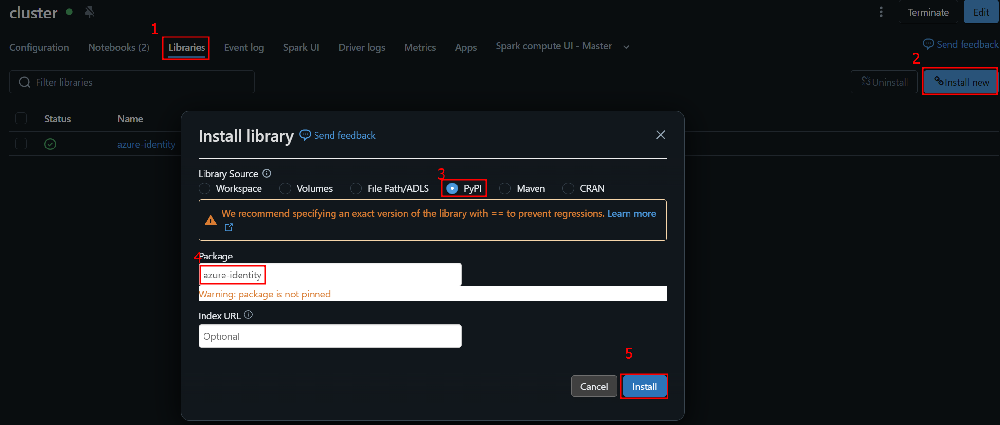

#### Get the workspace managed identity's object id
 When you create a Unity Catalog-enabled workspace, Databricks automatically creates a user assigned managed identity called "dbmanagedidentity" for it.  We can add it as a user to the database and give it the necessary permissions to allow us to read and write to the database from our notebook. Unfortunately, the name of the identity isn't unique so we'll need to use the object id when we add it to the database.

An easy way to get the workspace identity's object id is to start assigning an arbitrary RBAC role to it and grab its object id on the Review + Create tab.  You can then abort the assignment after you've copied the object id.
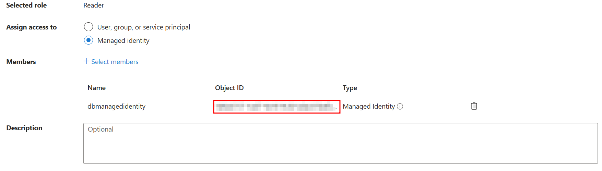
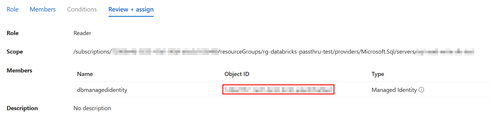

## Azure SQL DB
### Create the database
Create an Azure SQL database with Entra Id authentication. You can use the Adventure Works LT sample to pre-populate it with data if you like.  For the purposes of this demo, we will only be working with the ```information_schema```.
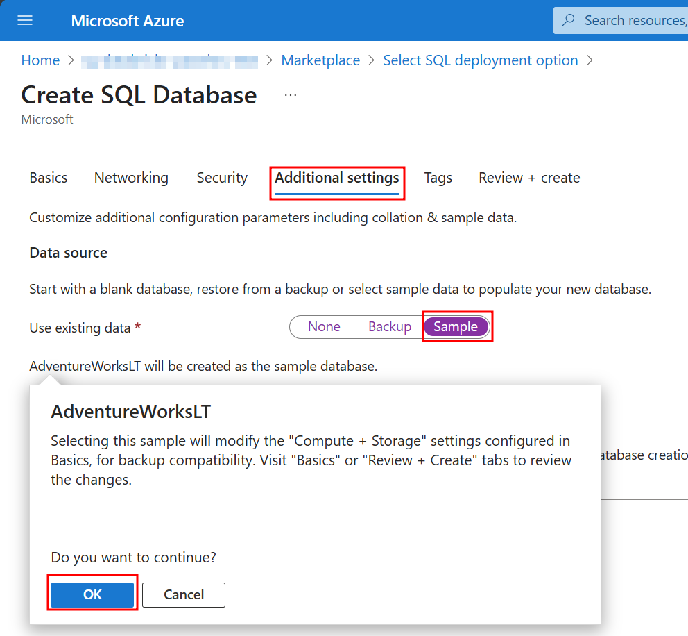

Then connect to the database using the Entra Id admin user and create a user for the dbmanagedidentity. You can use the Query editor in the portal or SQL Server Management Studio.
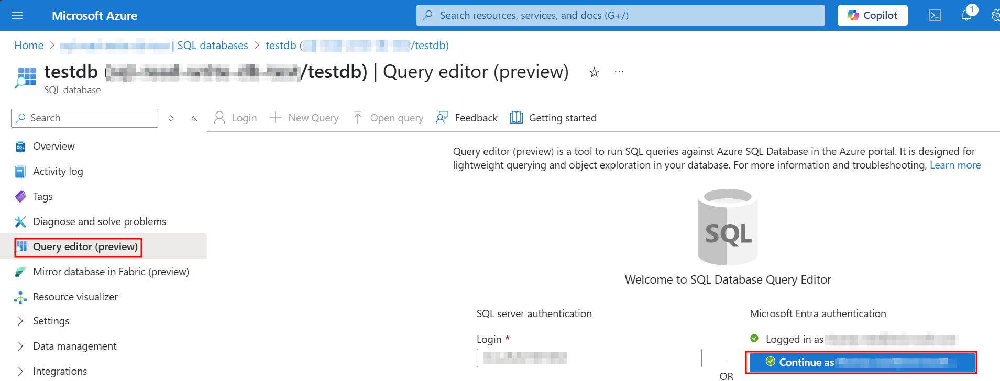

```SQL
CREATE USER [dbmanagedidentity] FROM EXTERNAL PROVIDER WITH OBJECT_ID = 'xxxxx-xxxx-xxxx-xxxxx';
```

Add the dbmanagedidentity user to database roles db_datareader, db_datawriter and db_ddladmin.  This will allow the managed identity to read and write data to existing tables.  Using overwrite mode will automatically drop and recreate a table before writing to it.
```SQL
ALTER ROLE db_datareader
ADD MEMBER [dbmanagedidentity];

ALTER ROLE db_datawriter
ADD MEMBER [dbmanagedidentity];

ALTER ROLE db_ddladmin
ADD MEMBER [dbmanagedidentity];
```

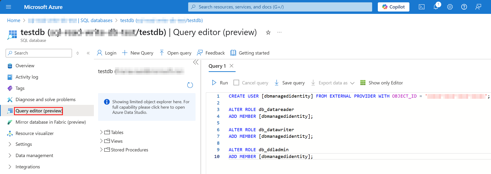

### Azure Databricks Notebook
Now switch back to your Databricks workspace and create an Azure Databricks notebook. Attach it to the cluster that we created earlier.

Add the code below to the first cell:
```python
from azure.identity import *
credential = DefaultAzureCredential()
token = credential.get_token("https://database.windows.net/.default").token
```
You can also use ```ManagedIdentityCredential()``` above instead. [DefaultAzureCredential](https://learn.microsoft.com/en-us/python/api/azure-identity/azure.identity.defaultazurecredential?view=azure-python) will use ```ManagedIdentityCredential()``` if service principal or workload identity hasn't been specified in the environment variables.

It's also possible to interactively authenticate the local notebook user by calling DeviceCodeCredential().  This will open a browser window for you to authenticate your device.  Your credentials will then be used to connect to the database.  Make sure that your user has been added to the database and the database roles db_datareader, db_datawriter and db_ddladmin like we did above for the workspace identity.
```python
from azure.identity import *
credential = DeviceCodeCredential()
token = credential.get_token("https://database.windows.net/.default").token
```
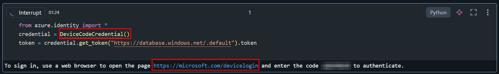

Then in the next cell we use the Entra ID token to make the connection to the database and read the list of tables from the INFORMATION_SCHEMA:
```python
jdbc_url = "jdbc:sqlserver://sql-xxxxxxxx.database.windows.net:1433;database=testdb"

connection_properties = {
    "accessToken": token,
    "driver": "com.microsoft.sqlserver.jdbc.SQLServerDriver"
}

# Read from a table
df = spark.read.jdbc(url=jdbc_url, table="INFORMATION_SCHEMA.TABLES", properties=connection_properties)
df.show()
```

The output should look something like this
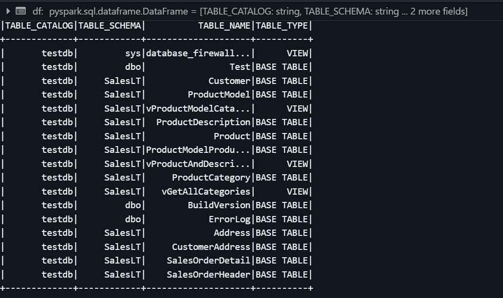

In a new cell, add the code below to drop and re-create the table and insert the data from the dataframe
```python
df.write.jdbc(
    url=jdbc_url,
    table="dbo.Test",
    mode="overwrite",
    properties=connection_properties
)
```

If you get a permissions error message, you can create a dummy table beforehand using the Query editor etc.
```SQL
CREATE TABLE dbo.Test
(ID int NULL);
```

Alternatively, you can create a table from an empty dataframe like this
```python
from pyspark.sql.types import StructType, StructField, IntegerType, StringType

# Define the schema
schema = StructType([
StructField("id", IntegerType(), True)
])

# Create an empty DataFrame with the schema
empty_df = spark.createDataFrame([], schema)

# Write to SQL Server (creates an empty table where the schema is defined)

empty_df.write.jdbc(
    url=jdbc_url,
    table="dbo.Test",
    mode="overwrite",
    properties=connection_properties
)
```

You can read the target table into a fresh dataframe to check that the data was written
```python
df_check = spark.read.jdbc(
    url=jdbc_url,
    table="dbo.Test",
    properties=connection_properties
)
df_check.show()
```
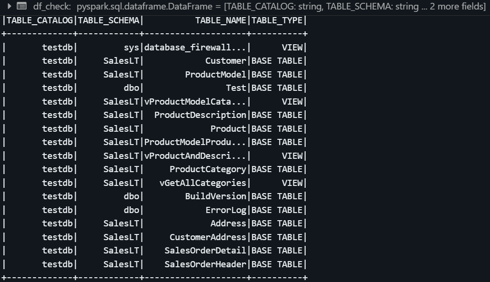

### Code
You can download the complete notebooks here:
- Authentication with [workspace user-assigned managed identity](./databricks/Read_Write_SQL_DB.ipynb)
- Authentication with a user account in a browser tab using a [device code](./databricks/Read_Write_SQL_DB_device.ipynb)

## Azure Postgres
The process for connecting to Postgres is very similar to how we did this in Azure SQL DB above.  The key differences are:
- Postgres uses different SQL commands used to map the user and assign permissions
- the user needs to be created in the ```postgres``` database and permissioned in the ```application``` database. For SQL we did all this in the user database.
- Postgres uses the public schema instead of dbo
- in the Databricks notebook, we connect to a different url to get the Entra ID token
- the driver used is different
- the jdbc url has a different format
- managed identity name and password fields (which is just the token) are both required in the connection properties

### Create the database
First create an Azure Database for PostgreSQL flexible server with Entra Id authentication.  Connect to the **postgres** database using the Entra ID administrator user and run
```SQL
SELECT * FROM pgaadauth_create_principal_with_oid('dbmanagedidentity', 'xxxx-xxxx-xxxx-xxxx','service',false, false);
```
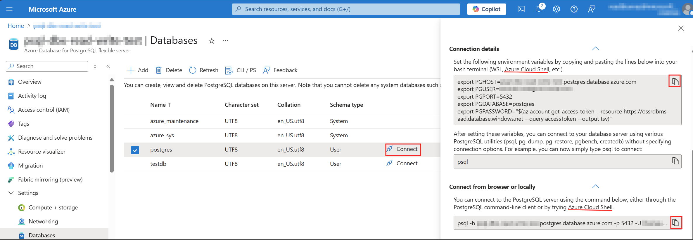
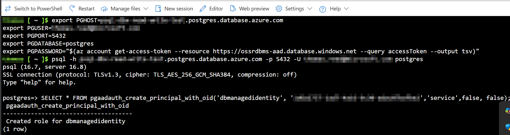

Then run the statement below in your **application** database to grant read and write privileges on all existing and future tables in the public schema
```SQL
ALTER DEFAULT PRIVILEGES IN SCHEMA public
GRANT SELECT, INSERT, UPDATE, DELETE ON TABLES TO dbmanagedidentity;

GRANT ALL PRIVILEGES ON SCHEMA public TO dbmanagedidentity;
```
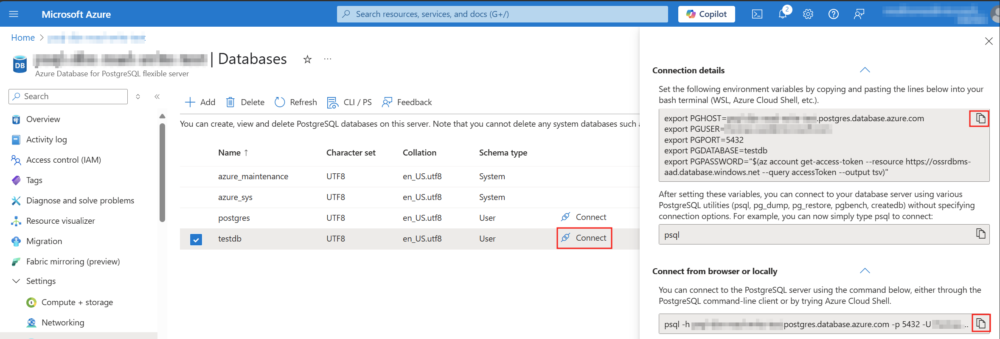
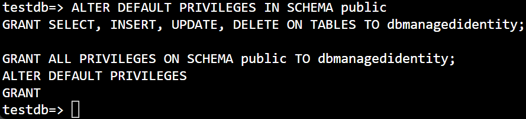


### Azure Databricks Notebook
In the first cell, add the code below. Notice that we're connecting to ```ossrdbms-add.database.windows.net``` and not ```database.windows.net``` like we did above for SQL: 
```python
from azure.identity import *
credential = DefaultAzureCredential()
token = credential.get_token("https://ossrdbms-aad.database.windows.net/.default").token
```

You can also use ```ManagedIdentityCredential()``` above instead. [DefaultAzureCredential](https://learn.microsoft.com/en-us/python/api/azure-identity/azure.identity.defaultazurecredential?view=azure-python) will use ```ManagedIdentityCredential()``` if service principal or workload identity hasn't been specified in the environment variables.

It's also possible to interactively authenticate the local notebook user by calling DeviceCodeCredential().  This will open a browser window for you to authenticate your device.  Your credentials will then be used to connect to the database.  Make sure that your user has been added to the database and the database roles db_datareader, db_datawriter and db_ddladmin like we did above for the workspace identity.
```python
from azure.identity import *
credential = DeviceCodeCredential()
token = credential.get_token("https://ossrdbms-aad.database.windows.net/.default").token
```

In the next cell, add the following code to connect to and read from the database into a dataframe. You need to specify the managed identity name as the user and pass the token for the password. Once the connection is made, however, we read and write to the database the same way we did for SQL.
```python
jdbc_url = "jdbc:postgresql://psql-xxxxxxx.postgres.database.azure.com:5432/testdb"

connection_properties = {
    "user": "dbmanagedidentity",
    "password": token,
    "driver": "org.postgresql.Driver",
    "ssl": "true",
    "sslfactory": "org.postgresql.ssl.NonValidatingFactory"
}

# Read from a table
df = spark.read.jdbc(url=jdbc_url, table="information_schema.tables", properties=connection_properties)
display(df)
```

Add a new cell and paste in the code below to write the contents of the dataframe to a new table in the database. The only difference to the SQL code above is that we are using the ```public``` schema in place of ```dbo```.
```python
df.write.jdbc(
    url=jdbc_url,
    table="public.Test",
    mode="overwrite",
    properties=connection_properties
)
```

Finally, let's add a cell to read the table contents into a dataframe to confirm that the data was written.
```python
df_check = spark.read.jdbc(
    url=jdbc_url,
    table="public.Test",
    properties=connection_properties
)
df_check.show()
```
### Code
You can download the complete notebooks here:
- Authentication with [workspace user-assigned managed identity](./databricks/Read_Write_PSQL_DB.ipynb)
- Authentication with a user account in a browser tab using a [device code](./databricks/Read_Write_PSQL_DB_device.ipynb)

